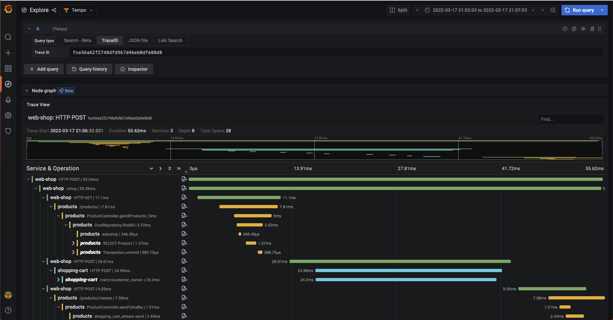

# Web Shop Observability Demo

This is a simple demo to show metrics, logs and traces collection and visualisation with the Grafana stack in a distributes microservice system.

## Overview

This demo spins up a simplified containerized "web shop" service.

Currently, it consists of:
* web-shop: a user interface that allows you to add items to a shopping cart, as well as delete all items in the shopping cart.
* shopping-cart: a backend service that interacts with a MariaDB instance. It persists the shopping cart items of the different users.
* products: a backend service that serves the available products of the web shop.
* mariadb: A mariadb instance to persist products and shopping cart items.
* shopping cart simulator: a service that simulates light user traffic by adding things to the shopping cart via the web-shop API.
* broker: a kafka broker to persist checked out shopping carts before they are reset.

Additionally, you have the required agents and instrumentation included as well as the backends to collect metrics, logs and traces:
* grafana: a Grafana instance to view and build dashboards, and explore the collected telemetry, as well as to create alerts on them. 
* agent: a Grafana Agent to scrape metrics, collect logs and traces
* prometheus: a Prometheus instance to act as the metrics backend
* loki: Grafana Loki to act as the logs backend
* tempo: Grafana Tempo to persist trace spans
* blackbox_exporter: an exporter to expose uptime metric of the services
* node_exporter: an exporter to expose metrics of the the underlying infrastructure

## Architecture

Quick Overview:
* The shop simulator service simulates user traffic on top of the web shop UI.
* The web shop UI is a Python Flask service that renders 2 HTML pages: the shop landing page as well as the shopping cart view. The shop landing page loads products by requesting them from the products API. The shopping cart view interacts with the shopping cart service to get the current shopping cart items from the user.
* The shopping cart service is written in Flask and offers an API to interact with MariaDB.
* The products service is written in Java Spring Boot and offers an API to load the currently available shop items from MariaDB.
* The products servie additionally has a Kafka producer and consumer implemented. The producer will send the content of the shopping cart as JSON to a Kafka topic. The consumer simply logs the message
* Telemetry is instrumented by using some of the available python otel libraries. It's collected using the OTEL collector of the Grafana Agent and then sent to Tempo.
* The Java autoinstrumentation is performed using the javaagent.
* Prometheus is configured to scrape the web shop service as well as the shopping cart API and the products API for metrics.
* Logs are collected using the Loki docker plugin. The plugin needs to be installed before starting the demo. Docker compose points to the local Loki container to persist the logs.

## How To get started

* Step 1: Configure your docker installation to use the Loki docker plugin for logging and point it to your loki instance.
  * Install loki docker driver: ```docker plugin install grafana/loki-docker-driver:latest --alias loki --grant-all-permissions```
  * Restart docker, e.g. on Linux: ```sudo systemctl restart docker```
  * Check if plugin is enabled: ```docker plugin ls```

* Step 2: Run the up script which will start docker compose in the background.
```
/bin/bash up.sh
```

* Step 2.5: Wait for some time. You probably don't need to restart any services, but it takes some time until all of them are up and running correctly even after docker-compose was run successfully.

* Step 3: Go to `<ip>:80/shop?name=<enter a name here>` to see the web shop interface.
  * If you didn't add any products the shop should be empty.
  * You can run this script to add 4 cats to the shop. Feel free to modify names, prices, tags and pic_refs as needed.
  ```
    curl -X POST -H "Content-Type: application/json" -d '{"name": "Meows", "price": "29.99", "tag": "cool", "pic_ref": "https://placekitten.com/251/250"}' localhost:8080/products/
curl -X POST -H "Content-Type: application/json" -d '{"name": "Loki", "price": "39.99", "tag": "", "pic_ref": "https://placekitten.com/251/251"}' localhost:8080/products/
curl -X POST -H "Content-Type: application/json" -d '{"name": "Charlie", "price": "19.50", "tag": "special", "pic_ref": "https://placekitten.com/250/251"}' localhost:8080/products/
curl -X POST -H "Content-Type: application/json" -d '{"name": "Carla", "price": "25.00", "tag": "special", "pic_ref": "https://placekitten.com/249/250"}' localhost:8080/products/
  ```
  * You should be able to see the 4 new products in the shop now.

* Step 4: Go to `<ip>:3000` enter `admin/admin` for username and password and change the password.
  * Go to the dashboards menu and open the "Holistic Webshop Monitoring" dashboard that gives you an overview including a drill down of the webshop services.

* Step 4.5: (in progress): go to the "Customer View" dashboard. This is meant for business users so they can track the number of transactions and revenue generated rather than the technical details that keep the webshop up and running.

* Step 5: Follow a single request trace from an initial POST request in your web-shop throughout data base interactions of the producs and shopping-cart APIs until a Kafka message is produced (screenshot below).



## What this demo should demonstrate

* How to use Grafana, Prometheus, Loki, Tempo and OpenTelemetry to reduce debugging time.
* How to use OpenTelemetry with Python Flask applications.
* How to use OpenTelemetry with Java Spring Boot applications.
* It demonstrates the interoperability of OpenTelemetry between microservices written in different languages and a realistic scenario.
