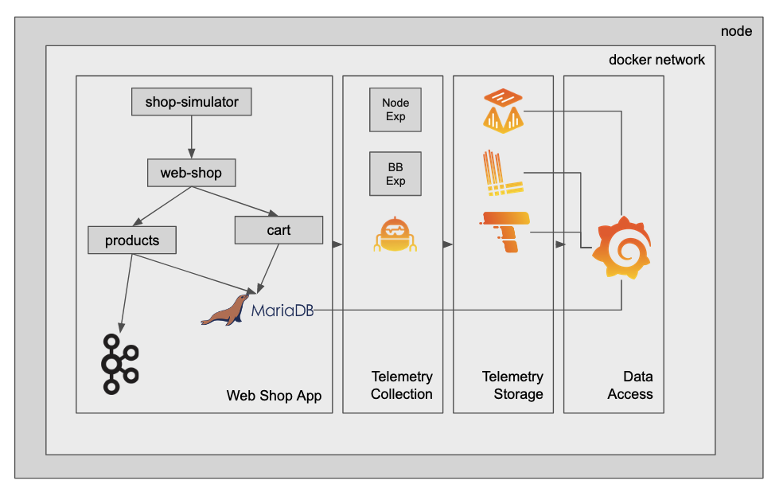
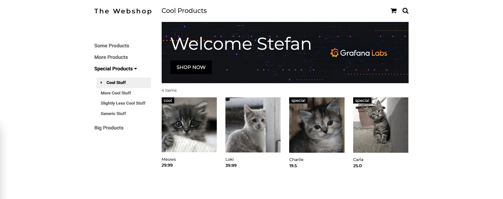
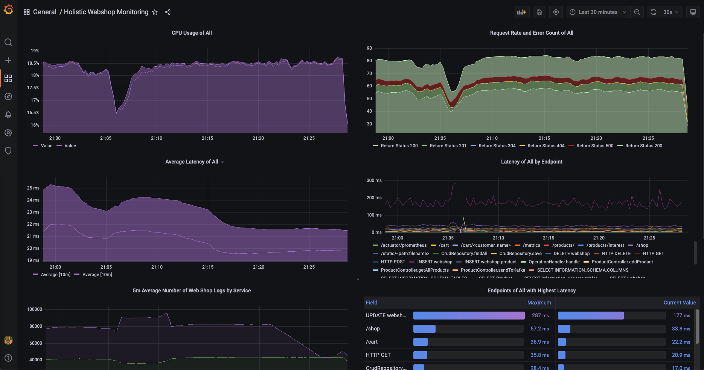

# Web Shop Observability Demo

This is a simple demo to show metrics, logs and traces collection and visualisation with the Grafana stack in a distributed microservices system.
Feel free to check out the code to all of the services and notice how it is instrumented to scrape and collect the telemetry.

## Overview

This demo spins up a simplified containerized "web shop" service.

Currently, it consists of:
* web-shop: a user interface that allows you to add items to a shopping cart, as well as delete all items in the shopping cart.
* shopping-cart: a backend service that interacts with a MariaDB instance. It persists the shopping cart items of the different users.
* products: a backend service that serves the available products of the web shop.
* mariadb: A mariadb instance to persist products and shopping cart items.
* broker: a kafka broker to persist checked out shopping carts before they are reset.


Additionally, you have the required agents and instrumentation included as well as the backends to collect metrics, logs and traces:
* grafana: a Grafana instance to view and build dashboards, and explore the collected telemetry, as well as to create alerts on them. 
* agent: a Grafana Agent to scrape metrics, collect logs and traces
* mimir: Grafana Mimir to act as the metrics backend
* loki: Grafana Loki to act as the logs backend
* tempo: Grafana Tempo to persist trace spans
* blackbox_exporter: an exporter to expose uptime metric of the services
* node_exporter: an exporter to expose metrics of the underlying infrastructure

## Architecture

Quick Overview:
* The shop simulator service simulates user traffic on top of the web shop UI.
* The web shop UI is a Python Flask service that renders 2 HTML pages: the shop landing page as well as the shopping cart view. The shop landing page loads products by requesting them from the products API. The shopping cart view interacts with the shopping cart service to get the current shopping cart items from the user.
* The shopping cart service is written in Flask and offers an API to interact with MariaDB.
* The products service is written in Java Spring Boot and offers an API to load the currently available shop items from MariaDB.
* The products servie additionally has a Kafka producer and consumer implemented. The producer will send the content of the shopping cart as JSON to a Kafka topic. The consumer simply logs the message
* Telemetry is instrumented by using some of the available python otel libraries. It's collected using the OTEL collector of the Grafana Agent and then sent to Tempo.
* The Java autoinstrumentation is performed using the javaagent.
* The Grafana Agent acts as an OTEL collected and is configured to scrape the web shop service as well as the shopping cart API and the products API for Prometheus metrics.
* Logs are collected using the Loki docker plugin. The plugin needs to be installed before starting the demo. Docker compose points to the local Loki container to persist the logs.

## How To get started

There are two options to deploy this demo. One option is to run it in a K8s cluster and send all the telemetry to Grafana Cloud. The other option is to run everything locally in docker-compose.


### Prerequisites
  * I've tested this on a Ubuntu machine, but it should run on any Linux based system using `systemctl`.
  * It gets stuck on a M1 MacBook, so I recommend a VM with 2+ cores and 4GB RAM.
  * `git`, `wget`, `docker` and `docker-compose` commands should be installed and accessible without `sudo`
  * Also `docker-compose` shouldn't be any older than `1.29.2`

### Installation
* Step 0:
```
git clone https://github.com/Condla/web-shop-o11y-demo.git
cd web-shop-o11y-demo
```

* Step 1:
  * Make sure you forward the port 3000 to your localhost (or run docker-compose on your local machine). This will be used to access Grafana.
  * Make sure you forward the port 3389 to your localhost (or run docker-compose on your local machine). This will be used to access the web application.
  * Make sure you forward the port 12347 to your localhost (or run docker-compose on your local machine). This is where the app agent receiver listens to front end telemetry sent directly from the browser.

> *Note*: Optionally you can set the environment variable `PUBLIC_APP_URL`. This should be set to the URL you are running the script from.
>```export PUBLIC_APP_URL=grafana.datahovel.com```
> In this case you need to make sure that the ports 3000, 3389 and 12347 are accessible from the public internet.

* Step 2: Run the up script which will start the application including the observability platform in the background.
```
/bin/bash up.sh
```

* Step 3: Lean back. The download of all docker images will take a while the first time you run this.

## Next Steps

Regardless of where you have deployed the app and the agents/backends you'll now have access to the web application accessible via port 3389.

* Go to `<ip|localhost>:3389/shop?name=<enter a name here>` to see the web shop interface.
* If you didn't add any products the shop should be empty.
* You can run the script below to add 4 kittens to the web shop:
```
# this will load kittens to the web shop
setup/add_products.sh default

# alternatively load some phones to the web shop
# setup/add_products.sh phones
```

  * If you refresh the web shop. You should be able to see the 4 new products in the shop now.



## Grafana Access

* Grafana is available via Grafana Cloud or running in docker-compose on port 3000. The default username password combination for the docker-compose instance is `admin/grafana`.
* Go to the dashboards menu and open the "Holistic Webshop Monitoring" dashboard that gives you an overview including a drill down of the webshop services.




## Run the realistic user simulation.

* To start a user simulation using k6 just run
  ```./simulate-user-traffic.sh```
* To stop the test press `Ctrl+C`
* This will create a bit of traffic on the web shop and allows you to start observing normal and strange patterns of the application with the help of Grafana.

## What this demo should demonstrate

There's multiple ways you could use this demo instance. There's multiple errors built in the simulation, the proxy is configured to reach a timeout to simulate proxy timeouts and many other scenarios to show how you can use the LGTM stack to solve issues.

I plan to publish some demo flows here.
